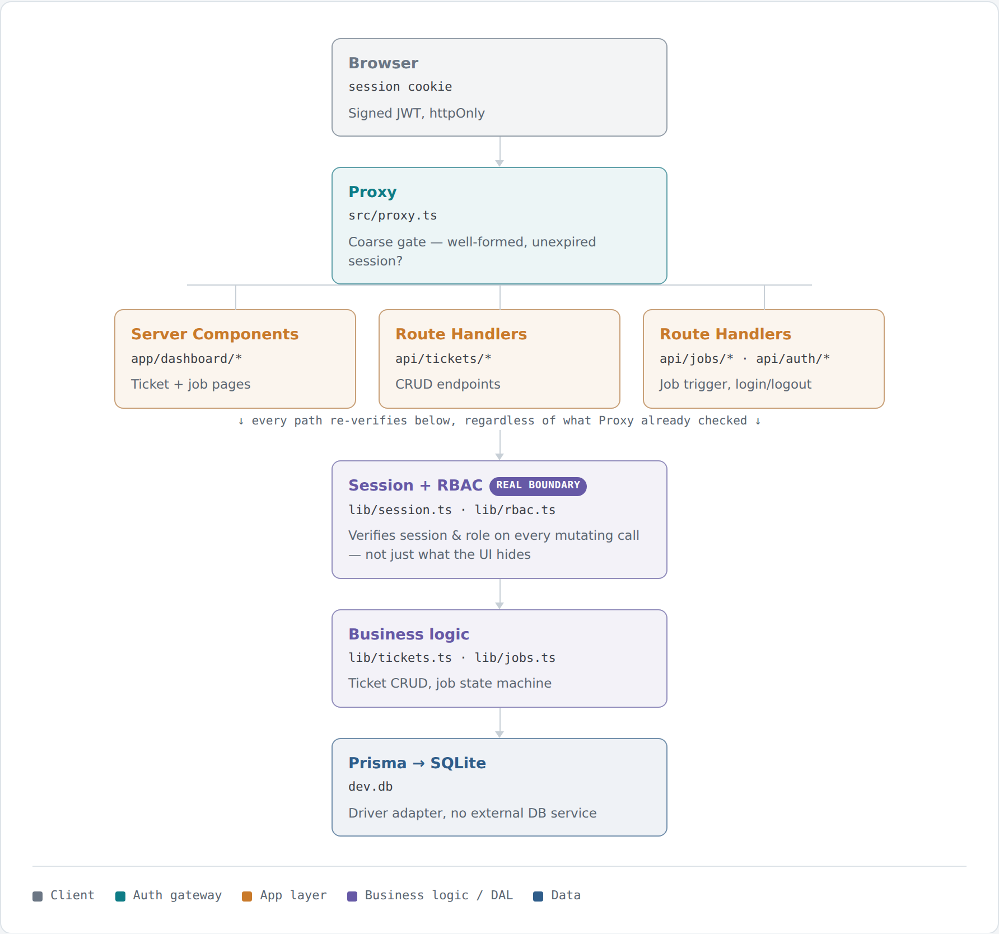

# OpsDesk

A small internal-tools console: a ticket dashboard, a background job runner, and a
handful of single-purpose utilities, all behind role-gated session auth.

## Why this exists

This is a public, self-contained version of an "internal tools" pattern I build
professionally — a small ops console that combines a CRUD dashboard, an
async-feeling background job runner, and standalone utilities behind one auth
layer. It's deliberately built on a different stack from my other public repo,
[BriefGen](https://github.com/pryzmatical/FunctionJunction) (Flask/Python, OAuth2
client-credentials): this one is Next.js/TypeScript end-to-end, with human
session login instead of machine-to-machine auth, and Prisma/SQLite instead of a
document pipeline — meant to show breadth rather than repeat the same pattern
twice.

## Architecture

<picture>
  <source media="(prefers-color-scheme: dark)" srcset="docs/architecture-dark.png">
  
</picture>

- **Auth**: `lib/auth.ts` is pure crypto (bcryptjs password hashing, `jose`
  JWT sign/verify) with no framework dependency, so it's directly unit-tested.
  `lib/session.ts` wraps it with the Next.js cookie APIs. `lib/rbac.ts` is a
  second pure module — `requireSession`/`requireAdmin` take a session value
  and throw typed errors — used identically from Route Handlers (converted to
  401/403 JSON) and Server Components (converted to a redirect).
- **Proxy**: Next.js 16 renamed Middleware to Proxy and (unlike old
  Middleware) it now runs on the Node.js runtime by default. `src/proxy.ts` is
  kept deliberately thin — cookie read + JWT verify + redirect — per Next's
  own guidance to treat it as a coarse first check, not the real
  authorization boundary.
- **Job runner**: triggering a job inserts a `QUEUED` row and returns
  immediately. An un-awaited function then drives `QUEUED → RUNNING →
  SUCCEEDED/FAILED` through timed transitions, and the UI polls until it
  reaches a terminal state. No external queue — see the Roadmap for the
  tradeoff this makes.
- **Toolkit**: `/dashboard/tools/*` — a JSON formatter/validator, a slug
  generator, and a line-based text diff — fully client-side, gated only by
  being logged in.

## Quickstart

```bash
git clone <this-repo>
cd opsdesk
npm install
cp .env.example .env
npm run setup   # prisma generate + migrate + seed
npm run dev
```

Visit `http://localhost:3000` and sign in with a seeded demo account:

| Role   | Email               | Password     |
| ------ | ------------------- | ------------ |
| Admin  | admin@example.com   | admin12345   |
| Viewer | viewer@example.com  | viewer12345  |

Admins can create/edit/delete tickets and trigger jobs; viewers are read-only
(enforced server-side, not just hidden in the UI — see Testing).

## Testing

```bash
npm test
```

Tests run against a separate SQLite file (`prisma/test.db`), migrated
automatically by a `pretest` script, so this works with no manual DB setup.
Coverage:

- Password hashing and JWT sign/verify roundtrips, including tampered,
  expired, and wrong-secret tokens (`tests/auth.test.ts`)
- The RBAC boundary as pure logic, independent of any framework
  (`tests/rbac.test.ts`)
- Ticket CRUD, including cascade-delete of a ticket's jobs
  (`tests/tickets.test.ts`)
- The job state machine, driven through its timed transitions with fake
  timers (`tests/jobs.test.ts`)
- Two HTTP-level checks proving a viewer-role session is actually rejected
  with a 403 at the route level — not just hidden in the UI — and that login
  accepts/rejects credentials correctly (`tests/api-rbac.test.ts`)

## Roadmap / stretch goals

- [ ] Swap the in-process timer-based job runner for a real queue (BullMQ +
      Redis) — the current approach only works on a persistent Node process
      (`next start`, Docker, a VM), not serverless/edge deploy targets where
      execution can be frozen after the response returns
- [ ] Playwright e2e coverage for the login → trigger job → poll flow
- [ ] Component tests (React Testing Library)
- [ ] Swap SQLite for Postgres + a hosted driver adapter for a real deployment
- [ ] Self-serve signup (currently just two seeded demo accounts)

## License

MIT — see [LICENSE](LICENSE).
